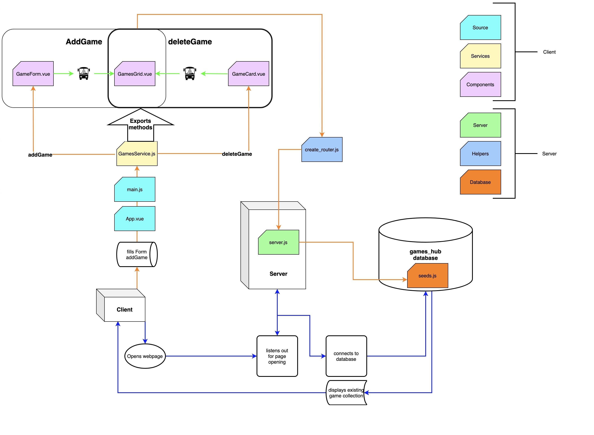

# Questions
### *What is responsible for defining the routes of the games resource?*

create_router.js

### *What do you notice about the folder structure? Whats the client responsible for? Whats the server responsible for?*

Client is responsible for adding, removing and editing data in database.
Server connects these actions with the database.

### *What are the the responsibilities of server.js?*

It connects with database, creates and api, and listens out for page opening. It also uses methods defined in create_router.

### *What are the responsibilities of the gamesRouter?*

It accesses games_hub, creates a collection, uses methods defined in create_router to add data from gamesCollection to the API.

### *What process does the the client (front-end) use to communicate with the server?*

fetch to receive data, and probably something built in Vue to feed data

### *What optional second argument does the fetch method take? And what is it used for in this application? Hint: See Using Fetch on the MDN docs*

It takes an init options object, used for posting a game.

### *Which of the games API routes does the front-end application consume (i.e. make requests to)?*

http://localhost:3000/api/games/

### *What are we using the MongoDB Driver for?*

To ensure compatibility with your operating system.

*Student's imaginary file relationships*